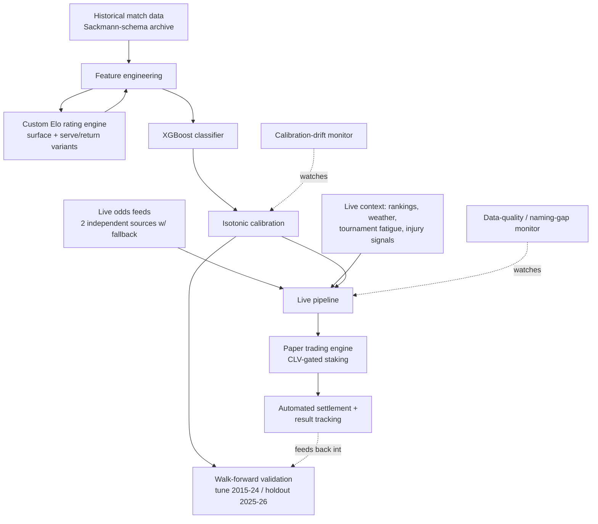

# ATP Match Prediction & Betting Model

A production ML system that predicts ATP tennis match outcomes and stakes paper bets against
live sportsbook lines, built and operated solo end-to-end: data engineering, modeling,
validation methodology, live deployment, and ongoing monitoring.

**This is a showcase, not the source repo.** The private implementation contains the specific
feature set, staking logic, and CLV thresholds that generate the model's edge — those aren't
shared publicly for the same reason a trading firm doesn't publish its alpha. Everything below
is real (metrics are pulled from the live validation logs), but describes the system at an
architecture/methodology level. I'm glad to go deeper on any part of this in conversation.

---

## Why this problem is harder than it sounds

Sportsbook lines for ATP tennis are set by professional oddsmakers and corrected by sharp
money within minutes of opening. "Predict the winner" is not the bar — a coin-flip-plus-vig
strategy loses money over time. The actual bar is beating the **closing line** (CLV), which
is the standard practitioners use because it's available immediately, doesn't require waiting
months for statistical significance, and is a good proxy for whether a model has found
something the market hasn't already priced in.

## Results snapshot

| Metric | Value | Context |
|---|---|---|
| Model | XGBoost + isotonic calibration | binary classifier, walk-forward validated |
| Out-of-sample AUC | **0.7275** | vs. 0.50 random; vs. ~0.73 in the strongest peer-reviewed benchmark I could find for this exact task; vs. ~0.748 for the closing-line market itself |
| Validation methodology | Walk-forward (train 2015–2024, tune/holdout 2025–2026) | avoids the lookahead leakage that inflates most public tennis-model claims |
| Live paper trading | 35 settled bets, in progress | pre-registered a 50-bet minimum sample before drawing any conclusion — **not yet reached**, numbers below are directional, not a track record |
| Realized vs. model-expected hit rate | 71.4% realized vs. 62.2% calibrated-expected | running ~9pts hot relative to the model's own probabilities — read as small-sample variance, not proof of extra edge, until the pre-registered sample size is reached |

The AUC gap to the market's own closing-line accuracy (0.7275 vs. ~0.748) is the honest
headline number: it means the model is competitive with, but has not beaten, a market that
prices in insider information (injuries, motivation, weather-day conditioning) the model
doesn't see. Closing the rest of that gap — or finding the specific situations where the model
already has an edge despite the average gap — is the ongoing work.

## System architecture

The same feature-computation code path is used for both training and live inference — a
single source of truth walks the full match history in chronological order for training, and
the live pipeline reuses those functions with live overrides (current rankings, in-progress
tournament fatigue, live odds) rather than maintaining a parallel implementation. This was a
deliberate design choice after an early lookahead-leakage bug taught the hard way what happens
when training and inference features can drift apart.

## Engineering highlights

- **Anti-leakage validation discipline.** Walk-forward tune/holdout split by year, not random
  k-fold — a random split would let the model "see the future" of a player's form. A
  lookahead-leakage bug was found and fixed mid-project by re-deriving every feature's
  computation window and confirming strict past-only dependence.
- **Pre-registered validation threshold.** A 50-settled-bet minimum was set *before* paper
  trading began, specifically to avoid the temptation to declare success on an early lucky
  streak. Current sample (34 bets) is reported with that caveat front and center rather than
  omitted.
- **Automated live deployment.** Runs unattended 3x/day via GitHub Actions: fetch live odds
  and match state → resolve player identities across data sources → build features → predict
  → stake (if the bet clears its CLV bar) → log. A separate scheduled job settles completed
  bets and refreshes player state daily during majors, weekly otherwise.
- **Self-monitoring infrastructure**, added after real incidents rather than speculatively:
  - A calibration-drift monitor retrains a genuinely out-of-sample model on a rolling window
    and compares its calibration (Brier score, reliability gap) against the live model —
    catching decalibration before it silently degrades staking decisions.
  - A data-quality monitor logs any tournament whose live-feed name fails to resolve against
    historical/enrichment data (sponsor names change year to year — a recurring real bug
    class this project has hit and fixed multiple times) so gaps surface automatically instead
    of quietly degrading a feature.
  - An audit trail for log corrections: when a data-integrity bug is found retroactively,
    affected rows are archived with a documented reason rather than silently deleted.
- **Fallback-aware data ingestion.** Two independent live-odds sources, since single-source
  APIs have real, observed gaps in tour-level coverage (e.g. lower-tier events). Player
  identity resolution across sources (different name formats, abbreviations) is handled by a
  dedicated, disk-cached resolution layer rather than ad hoc string matching per call site.

## Tech stack

Python · pandas / NumPy · XGBoost · scikit-learn (isotonic calibration) · GitHub Actions
(scheduling + CI) · live odds & sports-data APIs · git-tracked CSV logs as the system of
record for paper trading (deliberately simple — no database needed at this scale, and CSVs
keep every decision auditable in plain text).

## What I'd walk through live

- The lookahead-leakage bug: how it was found, what the fix looked like, and how the
  train/live feature-parity design now prevents that class of bug by construction.
- Why closing-line value (not raw hit rate) is the metric that matters, and how the walk-forward
  validation setup avoids the most common way tennis-model claims turn out to be inflated.
- The monitoring infrastructure — what triggered building each piece, since every monitor here
  was a response to a real incident, not built speculatively.
